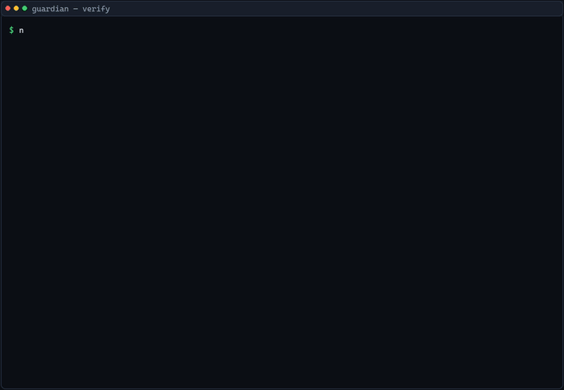
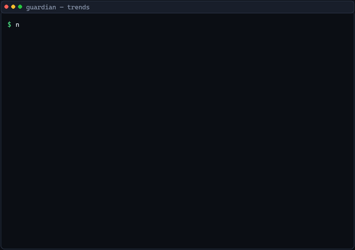
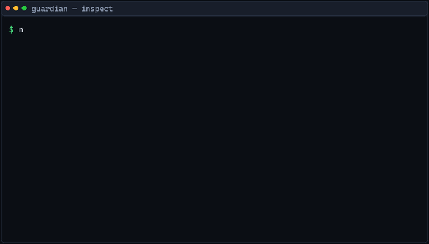
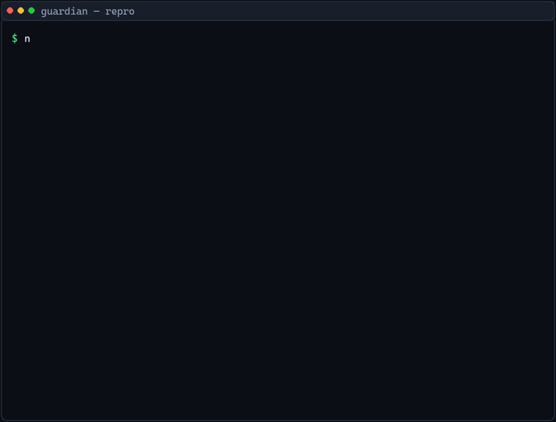
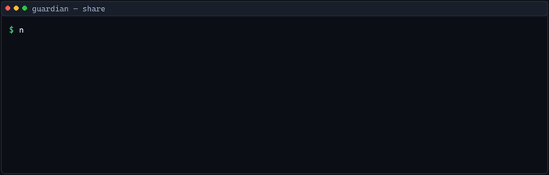
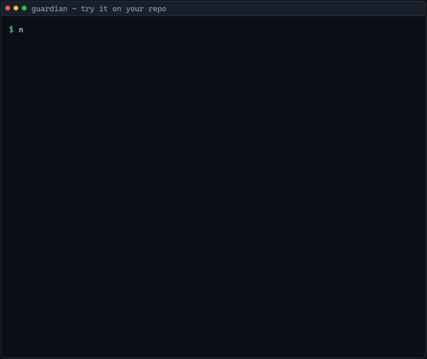
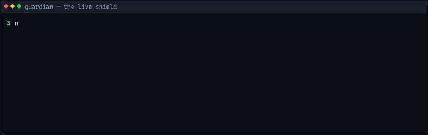
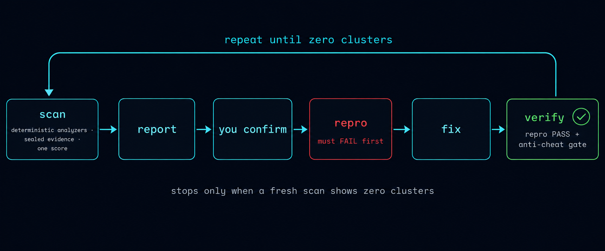

<p align="center">
  
</p>

# Guardian CLI

**The agent finally has a referee it can't cheat.** Guardian is a CLI that scans your repo,
scores it, and checks everything your AI coding agent does — so when it says "done", you
know it's actually done.

[](https://www.npmjs.com/package/cli-guardian)
[](https://github.com/Krish-1507/Guardian/actions/workflows/ci.yml)
[](LICENSE)

> AI coding agents are brilliant at fixing things — and equally brilliant at *saying they
> did* when they didn't. Guardian measures your repo with scans, seals every number so it
> can't be edited later, attacks your app with a live penetration test, and checks every
> change your agent makes. The exit codes tell you the truth: `0` clean · `1` suspicious ·
> `2` confirmed cheat.

---

## Why I built this

I spend my days running coding agents on real repos. They're brilliant at fixing things —
and equally brilliant at *telling me they did* when they didn't: focusing tests to hide
failures, deleting the failing test, editing an assertion to match the buggy output. I got
tired of auditing my agent's work by hand, so I built a referee.

Guardian is my own workflow tool, not a showcase: every repo I touch gets the loop, every
change gets the gate, and the numbers in this README are the same numbers I trust. It's
dogfooded hard — Guardian's own CI scans a real repo with Guardian on every push (Linux and
Windows), and the evidence chain is regression-tested because a bug in it once made Guardian
cry `TAMPERED` at baselines it had just written. If it can referee itself, it can referee
your agent.

---

## Quick Nav

| Jump to | |
|---|---|
| [Feature tour](#feature-tour) — the 11 demos | [Install](#install) · [Usage](#usage) · [Tool support](#tool-support) |
| [See it in 90 seconds](#see-it-in-90-seconds) | [What Guardian actually does](#what-guardian-actually-does) · [Every command](#every-command) |
| [Architecture](#architecture) | [Known limitations](#known-limitations) · [Contributing](#contributing) · [License](#license) |

**Straight to one feature:** [The scan](#the-scan) · [Verify](#verify) · [Trends](#trends) · [Inspect](#inspect) · [Repro](#repro) · [The pen test](#the-pen-test) · [Report](#report) · [Share](#share) · [Honesty](#honesty) · [Try it on your repo](#try-it-on-your-repo) · [The live shield](#the-live-shield)

---

## Feature tour

Every clip below is real command output — the only thing that was trimmed is dead time.

### The scan

`guardian scan` — every check runs at once, one box, one score.

<p align="center">
  
</p>

### Verify

`guardian verify` — re-scan after a change and see exactly how the score moved. Also checks your diff for cheat patterns.

<p align="center">
  
</p>

### Trends

`guardian trends` — per-category sparklines from your scan history.

<p align="center">
  
</p>

### Inspect

`guardian inspect <finding-id>` — open up one finding: the code snippet, the root cause, whether a repro test exists, and what Guardian remembers about these files.

<p align="center">
  
</p>

### Repro

`guardian repro <finding-id>` — every fix starts with a failing test. The test is written to fail *now* and pass after the fix.

<p align="center">
  
</p>

### The pen test

`guardian pen --fix` — boots your app in a sandbox, attacks it, and writes PROVEN verdicts — plus repro tests and a patch.

<p align="center">
  
</p>

### Report

`guardian report --html` — one self-contained HTML report, sealed with an evidence signature.

<p align="center">
  
</p>

### Share

`guardian share` — one-card summary, easy to paste into a PR or a demo chat.

<p align="center">
  
</p>

### Honesty

`guardian honesty --html` — an honest assessment of what this tool can't do.

<p align="center">
  
</p>

### Try it on your repo

`guardian try .` — score any repo in ~2 seconds, no setup, no config.

<p align="center">
  
</p>

### The live shield

`guardian watch` — re-scans the moment a file changes and prints the score delta.

<p align="center">
  
</p>

---

## See it in 90 seconds

Two commands. First, a real broken repo — scanned, scored and reported in seconds:

```bash
npx cli-guardian@latest demo
```

Then the part that gets the *wow*: a scripted arc where a lazy agent tries to make the
failing suite green without fixing the bug — and the gate catches both attempts:

```bash
node scripts/cheat-demo.cjs                             # from a Guardian repo checkout
node node_modules/cli-guardian/scripts/cheat-demo.cjs   # from any project that installed it
```

Set `GUARDIAN_CLI="node /path/to/dist/cli.js"` to run it against a local build instead
of the registry.

```
ACT 1  honest baseline              →  1 failed test, scanned and sealed
ACT 2  agent focuses passing tests  →  GATE: SUSPICIOUS     (exit 1) — blocked
ACT 3  agent deletes the test       →  GATE: CONFIRMED_CHEAT (exit 2) — blocked
       (tamper-evident evidence chain verifies the whole way)
```

<p align="center">
  
</p>

Deterministic, safe to run in a live room, and it's the whole product in miniature:
**Guardian measures, your agent edits, and the numbers can't be cheated.**
(Or watch the [34-second video](docs/media/guardian-demo.mp4).)

Not even 90 seconds? Point it at **your own repo** — zero setup, no install, no config:

```bash
npx cli-guardian try .
```

Two seconds, your repo, your score. Everything else can wait.

---

## Install

One command, that's it:

```bash
npx cli-guardian@latest install
```

Run it from inside any project directory. It writes the `/guardian` command into every
supported tool below — project-level for the current repo, user-level so it works in any
repo on your machine. Re-run with `-y` to refresh after updates (it's safe to re-run).

Requires Node.js 22+ (npm will warn on older versions).

## Usage

Open your repo in any supported tool and type:

```
/guardian
```

Bare `/guardian` prints this menu and waits:

```
Guardian modes:
 (enter) — full autonomous loop (scan, confirm, fix, verify, repeat)
 --scan-only — scan and report, no fixes
 --demo — run against Guardian's own seeded demo repo
 --ledger — payment idempotency fuzzing only
 --integrity-only — re-check the last commit for cheat patterns, no scanning
Reply with a mode, or just hit enter for the default full loop.
```

Hit enter for the default loop, or jump straight into a mode:

| Invocation | Mode | What it does |
|---|---|---|
| `/guardian` (bare) | menu | Prints the mode menu above and **waits**. Reply with a mode, or hit enter for the default full loop. |
| `/guardian --scan-only` | scan-only | Runs `cli-guardian scan`, prints the entire boxed report verbatim, and stops — no fixes, no commentary. |
| `/guardian --demo` | demo | Scaffolds Guardian's seeded broken demo repo into a temp dir, then runs the default full loop there. |
| `/guardian --ledger` | ledger | Runs `cli-guardian scan --ledger` (boots the app with every outbound HTTP call intercepted and replays duplicate-webhook / double-submit / retry traffic), then runs the loop restricted to the payment findings. |
| `/guardian --integrity-only` | integrity-only | Runs `cli-guardian integrity`, prints the boxed verdict verbatim, and stops — no scanning, no fixes. |

A flag after `/guardian` skips the menu and goes straight into that mode. If a tool ever
fails to substitute arguments into the prompt, Guardian falls back to the menu rather than
guessing.

No repo handy? `npx cli-guardian@latest demo` scaffolds a broken demo repo in a temp dir so
you can watch the whole loop — self-contained, no installs on the hot path, and it never
writes into your tool configs (that stays an explicit `guardian install`).

## Tool support

| Tool | Installed to | Status |
|------|--------------|--------|
| Claude Code | `.claude/commands/guardian.md` (project + user), plus a Skill at `.claude/skills/guardian/SKILL.md` | Full support |
| Cursor | `.cursor/commands/guardian.md` (project + user) | Full support |
| OpenCode | `.opencode/commands/guardian.md` (project), `~/.config/opencode/commands/` (user) | Full support |
| Kilo Code | `.kilo/commands/guardian.md` (project), `~/.config/kilo/commands/` (user) | Full support |
| Antigravity | `.agent/workflows/guardian.md` (project + user) | Full support |
| Gemini CLI | `.gemini/commands/guardian.toml` (project + user) | Full support |
| Codex CLI | `~/.codex/prompts/guardian.md` | Full support |
| Codex App / VS Code extension | — (no file written) | **Not supported** — OpenAI hasn't shipped custom slash commands there; install prints a manual-copy note instead |

Legacy/alternate locations are also written where tool docs are inconsistent across versions
(see `src/installer/targets.ts`). Existing files are never overwritten unless you pass
`-y`/`--force`; `npx cli-guardian install --uninstall` removes everything.

## What Guardian actually does

### The loop at a glance

<p align="center">
  
</p>

Guardian never touches your code. It checks, scores, and referees — your AI agent does the
editing, knowing it's being watched.

### The scan

`guardian scan` runs a bunch of checks on your repo: circular imports, known security
issues (`npm audit`, plus `pip-audit`/`osv-scanner` for Python and other stacks, and
`gitleaks`/`semgrep` when installed), duplicated code (`jscpd`), test results
(jest/vitest/pytest plus native suites for Go, Rust, Flutter/Dart, .NET and Java
(Maven/Gradle) — pass/fail, duration, coverage), build speed, accessibility, flaky-test
and race-condition heuristics, and developer-experience checks (unused exports, duplicate
functions).

Each check either contributes a real number, or prints `skipped` with a one-line hint on
how to install the tool it needs — it never makes up a number. Everything adds up to one
box that always opens with the **Guardian Score**: a single 0–100 health number (with an
A–F grade) across the categories that actually ran.

Scans are fast by design: the checks run **in parallel**, flaky detection runs the suite
**twice** by default (`--reliability-runs <n>` to tune; `1` disables it), and `npm audit`
(plus `osv-scanner`) results are cached for 24 hours (keyed on the lockfile hash) so
repeated scans inside one fix loop never hit the registry again.

## Every command

All 23 commands, grouped by job. Run them from inside a repo as `guardian …` (CLI) or
`npx cli-guardian …` (one-off); `/guardian` in a tool drives the loop, the rest are
one-shot.

**Measure — the numbers**

| Command | What it does |
|---|---|
| `guardian scan [path] [--json] [--reuse] [--ledger]` | The big one. Runs every check in parallel and prints one box with a single **Guardian Score** (0–100, A–F). `--json` for scripts and pipelines; `--reuse` returns the saved baseline when nothing changed; `--ledger` also fuzzes payment idempotency. |
| `guardian verify` | Re-scans after a change and shows exactly how the score moved — the numbers can't be argued with. Also checks your diff for agent-cheat patterns. |
| `guardian try [path]` | Get a score on **any** repo in ~2 seconds — no install, no config, no setup. Saves a sealed baseline so verify and gate can build on it later. |
| `guardian ready-check [path]` | Quick "is it worth scanning again?" — nothing changed → exit 0 and reuse the baseline; something changed → exit 1. |
| `guardian watch [path] [--interval ms]` | The live shield. Sits in a terminal and re-checks the moment you save a file, printing how the score moved. |
| `guardian trends` | Turns your saved scan history into per-category sparklines and a score trend — watch a repo actually improve. |
| `guardian budget [path]` | The token bill: how many scans/verifies/pens/repros you've run and the compute-seconds, plus advice on what to reuse in a fix loop. |

**The fix loop — what the agent is told to do**

| Command | What it does |
|---|---|
| `guardian drive <finding-id> [path]` | Hands one finding to *your own agent* (`GUARDIAN_AGENT` or `--agent '…{prompt}'`) with explicit orders: write a failing repro first, fix it, make the repro pass, then verify. Guardian referees the whole thing and never edits your code. |
| `guardian memory add/list/relevant` | A scratchpad inside the repo: record a decision (`add`), see them newest-first (`list`), or pull up anything related to a file (`relevant`) — so past fixes and rejected approaches survive across sessions. |
| `guardian inspect <finding-id>` | Opens up one finding: the code snippet, the root cause, whether a repro test exists, and what Guardian remembers about these files. |

**Integrity & anti-cheat — the referee**

| Command | What it does |
|---|---|
| `guardian gate [--score 60]` | A commit gate for CI or pre-commit: score threshold + regression risk + diff integrity + evidence signature. **Exit 0 = PASS · 1 = FAIL · 2 = CONFIRMED_CHEAT.** |
| `guardian integrity [path]` | Checks the latest commit or working tree for cheat patterns *without* a full scan: deleted or neutered tests, swallowed errors, suppression comments, hardcoded-to-pass values, mocked modules, forced exits. **Exit 0 = CLEAN · 1 = SUSPICIOUS · 2 = CONFIRMED_CHEAT.** |
| `guardian ci [path]` | CI-friendly scan + verify against the base branch → a PR-ready markdown report — the gate as a PR comment. It only reports; fixes stay local via `/guardian`. |

**Penetration test — attack your own app**

| Command | What it does |
|---|---|
| `guardian pen [path] [--fix] [--html] [--json]` | A real pen test of your own app. Static heuristics find candidates (secrets, routes, injection/SSRF/XSS), then it **boots the app in a sandbox** and attacks it live, recording every outbound HTTP call and spawned process. Findings are labeled `PROVEN` only when the sandbox saw real evidence; everything else is honestly `indicated`/`unproven`. Nothing reaches the real network; raw sockets are blocked. `--fix` writes failing-then-passing repro tests + `git apply`-able patches. Exit 0 = clean · 1 = high/critical · 2 = aborted. |
| `guardian inspect <pen-id>` | Deep-dives a pen finding: exactly what attack was fired, what the app responded with, the sandbox evidence lines, the fix, the repro. |
| `guardian repro <pen-id>` | Turns a pen finding into a regression test that boots the app — fails now, must pass after the fix. |

**Proof & reports — what you show people**

| Command | What it does |
|---|---|
| `guardian report --html` | One self-contained `GUARDIAN_REPORT.html` (inline SVG trends, integrity timeline, zero external assets). Also writes `GUARDIAN_BADGE.svg` — a README-ready shield: ``. |
| `guardian share` | Renders a 1200×630 share card (`GUARDIAN_CARD.html`) — score, trend, integrity/evidence chips, top findings. Screenshot it and post it. |
| `guardian digest [--days N] [--md]` | The progress story: how the score moved, what got fixed and what regressed, gate results, cheat catches, flakies, open findings. |
| `guardian honesty [--html]` | The proof that the numbers are real: evidence chain + integrity history + verify deltas + committed repro tests → one verdict, or a shareable HTML certificate. |

**Setup & transparency**

| Command | What it does |
|---|---|
| `guardian install` / `install --uninstall` | Writes `/guardian` into every supported tool (project + user level). `--uninstall` removes it all. |
| `guardian doctor` | Explains why categories show `skipped`: checks your toolchain (Node, git, jscpd, gitleaks, semgrep, pa11y) and prints copy-paste install hints. |
| `guardian prompt [--args …]` | Prints the exact prompt your AI tool expands `/guardian` into, with your arguments filled in — full transparency into what the agent was told. |
| `guardian demo [demo]` | Scaffolds an intentionally-broken demo repo into a fresh temp dir (`demo-repo`, `demo-repo-integrity`, `demo-repo-fintech`, `demo-repo-generators`), initializes git, and scans it immediately. |

### The score & badge

Skipped categories are excluded and the weights re-adjusted, so a missing `jscpd` never
silently drags the number down. The verify Δ compares against the last scan with the *exact
same categories measured* — a category skipped on both sides can't move the score. The
score only moves when your code does.

### Tamper-evident evidence

Every scan, verify and integrity document Guardian writes gets a `sha256` fingerprint of
its own contents (`guardian-sha256-canonical-v1`, deterministic key-sorted JSON). Edit the
JSON after the fact — inflate a score, delete a finding — and the next
`guardian verify`/`guardian gate` recomputes the fingerprint, sees the mismatch, and
reports the chain as broken. Guardian can't be tricked into endorsing a baseline it didn't
write; the `gate` exit code treats a broken chain as a hard fail.

### Prompt transparency

Some AI tools show you the expanded slash-command prompt in their UI, some don't. Guardian
guarantees you see it either way: the `/guardian` prompt's **Step 0** makes the agent print
the exact instructions it's operating under (mode, sequence, guardrails) as its very first
message in your window — and `guardian prompt` lets you preview the raw prompt before
anyone types anything.

### Root-cause correlation

Findings that touch the same files get grouped into one root cause, so the box shows
`1 root cause → 2 symptoms` instead of a flat list. Every cluster gets a stable id (e.g.
`security-19c390c6`) that the repro step can reference.

### Confirm, then loop

The agent prints the boxed summary, then **waits for your one-time OK**. After that it
works through each cluster on a `guardian/*` branch: capture the bug as a failing test
first (`guardian repro <id>`), make the smallest fix, pass the same repro test, run
`guardian verify`, and commit. It re-scans after every fix and stops when a fresh scan
shows zero clusters (hard limits: 10 fix rounds or 45 minutes), ending with a
`GUARDIAN_REPORT.md`.

### Ledger mode (opt-in)

`guardian scan --ledger` boots your app with **every outbound HTTP call rerouted to a mock
gateway**, then replays the three classic payment bugs: duplicate webhook, concurrent
double-submit, delayed retry. If the mock gateway's own receipt log shows more than one
charge per idempotency key, that's a **proven double-charge** — not a guess. The shipped
`demo-repo-fintech` fixture produces three such PROVEN findings because its charge and
webhook endpoints have no idempotency guard. If the sandbox can't intercept some traffic,
the run aborts (`exit 77`); nothing ever reaches a real gateway.

**Which stacks are covered?** Node/JS apps run under the nock preload, which intercepts
every outbound call in-process. Go, Python, Rust and .NET apps run under a recording
`HTTP_PROXY` sandbox that answers the known payment-gateway hosts with mocked receipts
and 502s everything else. Java and Dart are refused (their HTTP clients don't honor
`HTTP_PROXY`, so interception could not be guaranteed). HTTPS stays blocked (502): without
a trusted CA the proxy cannot terminate a CONNECT tunnel, so an HTTPS double-charge is
reported as *indicated*, never *proven*. Native binaries and raw sockets bypass the proxy
and are not observed. Set `GUARDIAN_START` to override start-command guessing for
non-Node repos.

### Integrity gate

Every `guardian verify` also diffs your change against HEAD and checks for the classic
agent-cheat moves: deleted or loosened tests, tests focused to hide failures
(`fit`/`test.only`), swallowed exceptions, suppression comments, hardcoded-to-pass values,
a mocked module-under-test, a forced `exit(0)` in app code, or an assertion's expected
value edited to match the buggy output. A caught cheat looks like this: change
`assert.equal(round2(8.075), 8.08)` to expect `8.07` with nothing else in the diff →
`CONFIRMED_CHEAT`, the change is blocked, and a human reviews it (verified against
`fixtures/assertion-literal-tamper/`). An honest app-side fix sails through `CLEAN`.

### Cheat-catch demo

Want to *see* it? The scripted arc from **[See it in 90 seconds](#see-it-in-90-seconds)**
is `scripts/cheat-demo.cjs` — a fully deterministic SUSPICIOUS → CONFIRMED_CHEAT
sequence against a real repo with a real failing jest test. Point it at a build with
`GUARDIAN_CLI="node /path/to/dist/cli.js"`, or let it use `npx cli-guardian`. Great for a
video or a live judge's demo.

## Architecture

Guardian is two pieces that never mix: a **CLI that measures**, and **your host agent that
reasons and edits**. The CLI produces the scan/verify numbers and the gate verdicts; the
model in whichever tool you're using reads them, decides what to change, and does the
editing through the `/guardian` prompt template. This is deliberately *not* one monolithic
agent — the numbers can't be talked into looking better, and the agent can't silently
cheat its own referee. That separation is the product.

## Known limitations

- **Windows** is CI-verified on every push (build + smoke on `ubuntu-latest` and
  `windows-latest`), and the Windows-specific bugs were reproduced and fixed on a real
  Windows host during development — but not every workflow has been exhaustively manually
  tested on Windows.
- **Codex App / VS Code extension** isn't supported and won't be until OpenAI ships custom
  slash commands; use Codex CLI for `/guardian`.
- **Graceful degradation:** duplication (`jscpd`), secrets/code scanning (`gitleaks`,
  `semgrep`), dependency CVEs (`pip-audit`, `osv-scanner`), and accessibility runtime
  checks (`pa11y`/`axe`) run only when that tool is installed locally. The scan reports
  `skipped` for those categories and works fine without them.
- Requires **Node.js 22+** (the CLI depends on execa 10, which uses ES2024 `Set.union`).
- **Multi-stack honesty:** test runs (JS, Python, Go, Rust, Flutter, .NET, Java via Maven
  or Gradle), dependency CVEs, and the `pen`/`ledger` sandboxes are real for Node/JS and
  best-effort elsewhere. Go/Rust/Python/.NET apps run under the `HTTP_PROXY` recording
  sandbox (see Ledger mode); Java and Dart are refused for ledger, and proxy-mode results
  are labelled `indicated`, never `proven`, when the proxy cannot observe the traffic. The
  native test runners parse each toolchain's real output (`go test -json`, `cargo test
  --format json`, `flutter test --machine`, dotnet/maven/gradle summaries) and report
  `skipped` when a toolchain isn't on PATH.
- **Pen-test honesty:** `guardian pen` reports each finding with a **runtime-proof
  verdict**: **proven** (the live dynamic attack confirmed it under the sandbox),
  **indicated** (static rule fired but the dynamic phase couldn't confirm), **unproven**
  (the dynamic phase ran and found no evidence for that rule), or **not-tested** (dynamic
  phase aborted). Proven findings are real; everything else is a hypothesis until you
  replay the attack yourself. The sandbox records outbound connections and spawned
  processes instead of blocking them (so real bytes never leave your machine for canaries,
  but a compromised app could still run commands locally); raw socket APIs are blocked
  outright. `pen --fix` writes deterministic patches **only** for findings fixable by pure
  insertion (e.g. missing `helmet()`, `x-powered-by` leaks) — anything else gets a failing
  repro test and fix guidance, which is your contract for the fix.
- **`drive` verdicts** for runtime pen findings come from the repro test (FAIL first, PASS
  after the fix), not from the static score — the static gate has nothing to say about a
  runtime-only finding.

## Contributing

Guardian is built to be extended — adding a whole new analyzer is a small, well-scoped
change. See [CONTRIBUTING.md](CONTRIBUTING.md) for the analyzer interface, conventions, and
how to open a PR. For the launch notes and the "why", read [LAUNCH.md](LAUNCH.md).

## License

[MIT](LICENSE)

---

<p align="center">
  
</p>

<p align="center">Built by <b>Krish J</b> — if it can referee itself, it can referee your agent.</p>
